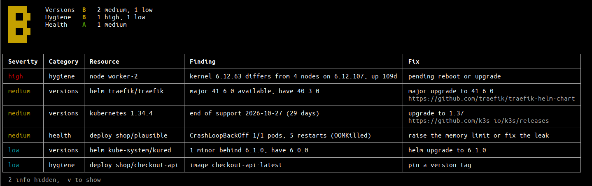

# kubegrade

Grades the upkeep of your Kubernetes cluster from A+ to F.

It scans read-only from your kubeconfig for outdated versions, sloppy config
and unhealthy workloads, and suggests a fix for each finding. Nothing about
the cluster leaves your machine; version data comes from [endoflife.date](https://endoflife.date) and
[Artifact Hub](https://artifacthub.io).

```sh
curl -sL https://github.com/filidorwiese/kubegrade/releases/latest/download/kubegrade_$(uname -s | tr A-Z a-z)_$(uname -m | sed 's/x86_64/amd64/;s/aarch64/arm64/') -o kubegrade && chmod +x kubegrade
```

Or `go install github.com/filidorwiese/kubegrade/cmd/kubegrade@latest`.

```sh
kubegrade                 # current context
kubegrade -v              # include info findings
kubegrade --format json
```

Flags: `--context`, `--format text|json`, `-v`, `--no-color`. Reads `$KUBECONFIG` or `~/.kube/config`.
Needs cluster-wide read access, including Helm release secrets.



## Included tests

- **Versions**: Kubernetes, kernel and OS support windows, kubelet skew, Helm charts vs upstream and deprecated charts.
- **Hygiene**: deprecated APIs, `:latest` tags, missing digests, Helm revision pile-up, node drift, evicted, finished and controller-less pods.
- **Health**: crash loops, frequent restarts, image pull failures, pending pods, unavailable deployments, failed releases, NotReady nodes, node pressure, full node disks and volumes.

## Scoring

Each category starts at 100 and loses low 3, medium 8, high 15, critical 30
per finding. A+ 95, A 85, B 70, C 55, D 40, else F. The overall grade is the
average, never better than the worst category. Scores are in the JSON output.
